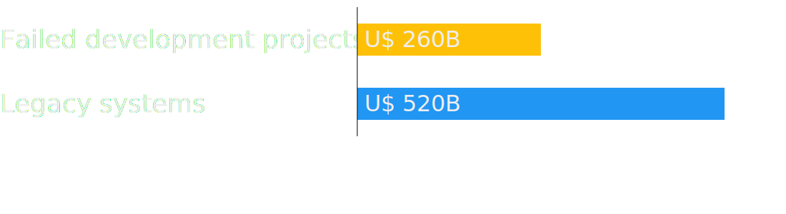
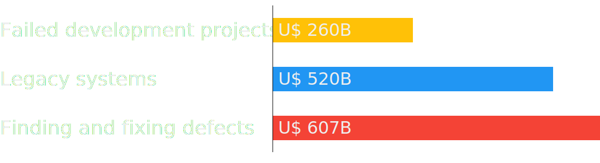
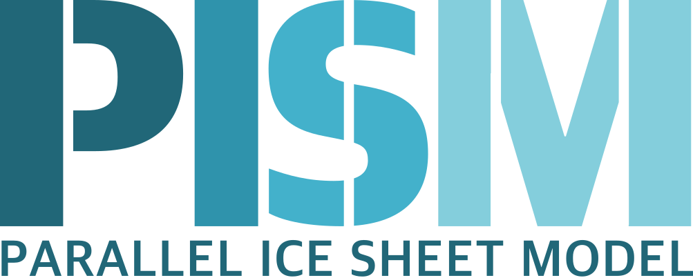
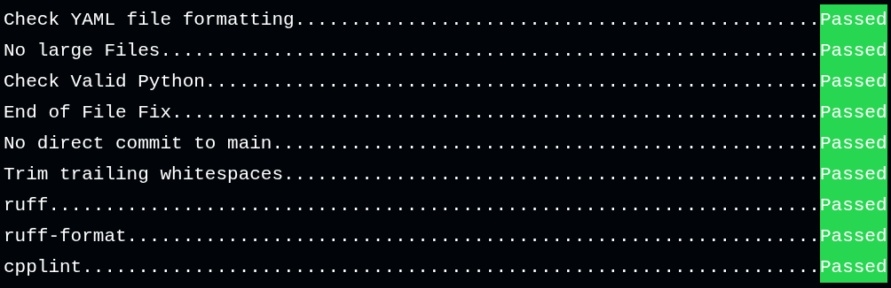
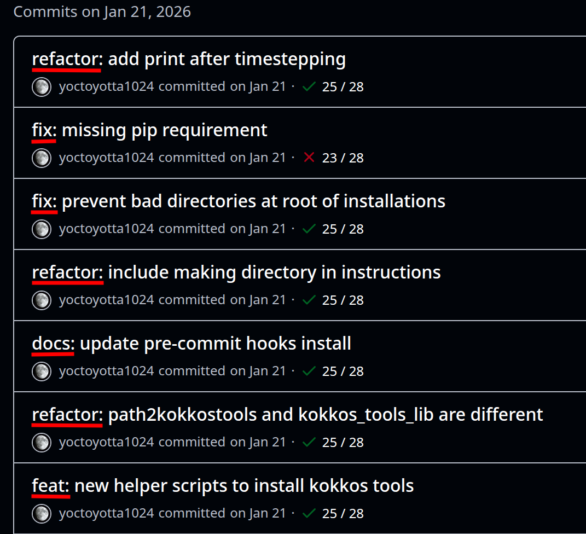
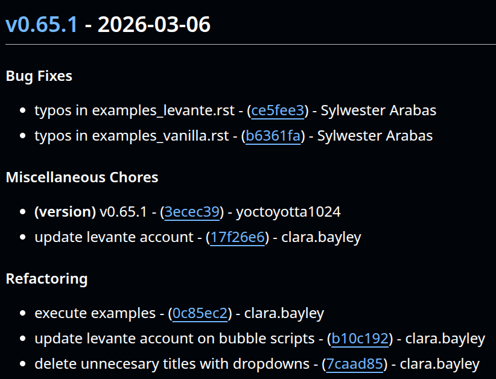

## The state of affairs {background-image="images/default_background.jpg"}

::: {.r-stack}
{.fragment fig-align="center" width=40%}

::: {.fragment .absolute top=170 width=250 left=43%}
Earth System Modelling
:::

::: {.fragment .absolute top=580 width=250 left=43%}
HPC Scientific Software
:::

::: footer
Photo Credit: Pexels/Vincent Delsuc
:::

:::

## Like Atlas, HPC software is not feeling well {background-image="images/sad_statue.jpg" background-position="0% 50%" background-size="120%"}

. . .

 
Organic development

. . .

 
No trained software engineers

. . .

 
Understaffed institutions

. . .

 
Software seen only as a tool

::: footer
Photo Credit: Pexels/Jean-Baptiste Terrazzoni
:::

## Poor software quality is a huge waste of resources {background-image="images/default_background.jpg"}

. . .

 
Software quality costed the US economy **U$ 2.41 Trillion** in 2022^1^

::: {.r-stack}

{.fragment}

{.fragment}

{.fragment}

:::

## The costs {background-image="images/iceberg.jpeg" background-position="0% 20%" background-size="120%"}

## Visible costs {background-image="images/iceberg.jpeg" background-position="35% 0%" background-size="230%"}

. . .

 
Model inaccessability

. . .

 
Wrong and failed experiments

. . .

 
User support

## Hidden costs {background-image="images/iceberg.jpeg" background-position="25% 100%" background-size="180%"}

::: {.columns}
::: {.column}

::: {.fragment}
 
Fixing bugs
:::

::: {.fragment}
 
Complex code
:::

::: {.fragment}
 
Technical debt
:::

::: {.fragment}
 
Longer onboarding
:::

:::

::: {.column}
::: {.fragment}
 
Excessive systems costs
:::

::: {.fragment}
 
Lost research opportunities
:::

:::

:::

## natESM comes to help {background-image="images/default_background.jpg"}

. . .

 
 
Improving **technical infrastructure to serve Science**

. . .

 
6 months projects (sprints)

. . .

 
Well-defined **goals and timeline**

## Improvements done by natESM {background-image="images/default_background.jpg"}

 
 

::: {.r-stack}

{.fragment}

{.fragment}

{.fragment}

:::

::: {.notes}
Think of a better title
Correct the plot
:::

## natESM has improved many ESM models {background-image="images/default_background.jpg"}

{.fragment .absolute top=270}

{.fragment .absolute left="250" top=220}

{.fragment .absolute width="30%" left=450 top=270}

{.fragment .absolute width="15%" left=900 top=220}

{.fragment .absolute top="470" width="40%"}

{.fragment .absolute  top="420" left=550}

{.fragment .absolute width="20%" top="470" left=800}

::: {.fragment .absolute top="660"}
And more... 
:::

::: {.notes}
Get the exact number of models and more examples to talk about
:::

## The case of CLEO {background-image="images/default_background.jpg"}

. . .

 
Cloud microphysics superdroplet model

::: {.columns .absolute top=280}

::: {.fragment .column width="33%"}
{width="40%"}
 
Parallelization  with MPI
:::

::: {.fragment .column width="33%"}
{width="40%"}
 
Coupling  with ICON
:::

::: {.fragment .column width="33%"}
{width="40%"}
 
Versionining
 
Releases
 
Git workflows
 
CI/CD
:::

:::

## CLEO - CI expansion {background-image="images/default_background.jpg"}

::: {.columns}
::: {.column}
::: {.fragment}
Semantic versioning  
{width=10vw}
:::

::: {.fragment}
Precommit  

:::
:::

::: {.column .fragment}
Conventional commits  
{heigth=5vh}
:::
:::

## CLEO - Release improvements {background-image="images/default_background.jpg"}

::: {.columns}
::: {.column}
::: {.fragment}
Automatic releases  

:::

::: {.fragment}
Automatic changelog  

:::
:::

::: {.column}
::: {.fragment}
Linear Git history
:::

::: {.fragment}
 
Documentation generation
:::

::: {.fragment}
 
CI builds for all examples
:::

::: {.fragment}
 
Serial and parallel CI runs
:::

:::
:::

## Changing software and workflows can be challenging {background-image="images/default_background.jpg"}

. . .

 
Convincing about utility

. . .

 
Old habits are hard to change

. . .

 
Lack of enforcing turns into lack of use

. . .

 
Delayed merging can require large reworks

## You can only improve what you can measure {background-image="images/default_background.jpg"}

. . .

 
We are creating a simple framework to list software quality deficiencies

. . .

 
Evaluation produces a **score** for the model

. . .

 
List of actionable items that can be worked on during a sprint

## How the framework works {background-image="images/default_background.jpg"}

::: {.columns}
::: {.column width=60%}

::: {.fragment}
 
Collection of bad points of models
:::

::: {.fragment}
 
Reproducible and fairly objective
:::

::: {.fragment}
 
Can be used to track the model evolution
:::
:::
::: {.column .fragment width=40%}
 

:::
:::

<!-- ## Conclusion {background-image="images/default_background.jpg"}

. . .

 
Poor software quality has large and often hidden costs 

. . .

 
natESM has improved many models with its sprints

. . .

 
We are introducing a software quality evaluation framework to further improve our component models -->

## Conclusion {background-image="images/default_background.jpg"}

. . .

 
 
 

"Over a 25-year life expectancy of a large software system, almost **fifty cents out of every dollar** will go to finding and fixing bugs."^1^

## References {background-image="images/default_background.jpg"}

 
1 - Consortium for Information & Software Quality (CISQ). The Cost of Poor Software Quality in the U.S.: A 2022 Report. CISQ, 2022, https://www.it-cisq.org/the-cost-of-poor-quality-software-in-the-us-a-2022-report/ 

 
2 - Krasner, Herb. "The cost of poor quality software in the us: A 2018 report." Consortium for IT Software Quality, Tech. Rep 10 (2018): 8.